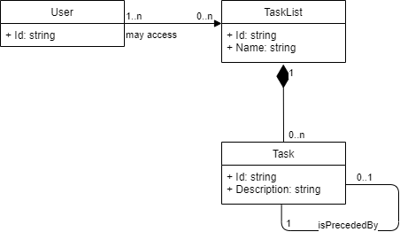
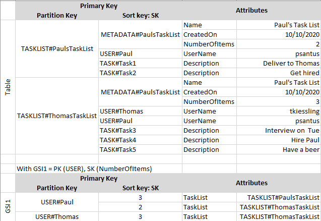

# Task-list exercise

## Functional overview

### Data Model

- (Multiple) Users may access TaskList(s)
- Each TaskList may contain multiple Tasks
- Within a TaskList, tasks are sorted

### Services
* TaskList: 
    * Create
    * Delete
    * List
    * Share
    * Leave
    * Get tasks
* Task
    * Create
    * Delete
    * Move after Task
* We're not describing User management services here.
    * For the purpose of this demo, 2 users will be created in Cognito user pool
    * This [workshop](http://regappworkshop.com/overview/appsync/) offers an example of such 
    registration feature.

## Technical requirements
1. API should be easy to call by cross-platform client apps, including native mobile apps
1. API should scale on millions of TaskLists, and thousands of Tasks per TaskList
1. Near real-time sync
1. Works offline and syncs when back online, with conflict resolution strategy

## Approach
* The back-end (API) will rely on AWS AppSync service, which comes with a number of features supporting our use case:
    * Subscription, enabling for near-realtime sync
    * Row-level access control and user management with AWS Cognito
    * Scalability with AWS DynamoDB
* The front-end (Client) will be developed using AWS Amplify, which provides
    * Easy support for multiple client-side technologies (including Android, iOS, and single-page JS Frameworks like 
    Angular), using Amplify CLI 
    * Client-side storage using Amplify Datastore, enabling offline use  

That being said, 2 options are possible:
1. Use Amplify CLI to automate client and infrastructure generation. This option is the most straightforward, and I 
chose to use it to quickly prototype my application and learn the Amplify framekwork. However, 
    - it offers (until I get to know the Amplify framework intimately) less control on data structure, with probable 
    perf. issues when scaling
    - important features, such as row-based access control, will be added later on.
1. Deploy the backend using CloudFormation first, and only then generating the client App using Amplify CLI. 
 This enables to describe precisely
    - DynamoDB tables, primary and sorting keys and secondary indexes, tuning them based on our use-case
    - GraphQL mutations and queries 

* An few remarks on data model:
    * As the most frequent mutation will be task prioritization, we don't use an absolute rank column (that would 
    require rewriting all the tasks every time a task is moved) but rather a "followingTask" field. Hence moving a task
    will only modifying two other tasks (its previous predecessor, its new predecessor) on top of the task itself.
    * Since a Tasklist only contains limited number of tasks, we can load all the tasks locally and let the client app 
    rebuild the ordered list
    * Amplify CLI is not able to generate API in case the GraphQL schema has a Many-to-many relationship. A few 
    workarounds are possible
        1. Creating a "join table" type. This option is the most obvious one, and the one I chose here in order to 
        overcome Amplify CLI limitation with DynamoDB. This "relational approach" might not be the best way to use a 
        NoSQL DB such as DynamoDB. However it matches our use case where the dummy approach consists in 
            - First querying the User x TaskList join table
            - Then, fetch Tasks belonging to user-accessible TaskLists
        1. Better use DynamoDB, using for instance the following data structure
        
        1. Go relational, using Aurora

* One remark on conflict resolution:

    
## Organisation of this repository and set up

* In /infra folder contains templates enabling to deploy the back-end (Option 2 aforementioned)
* In /client folder we used Amplify CLI to generate client app as well as backend API.

## Progress report

* Oct 9th, evening (~3h): 
    * Initial requirements analysis => identification of AWS AppSync + Amplify as good candidates to deliver on those
    * 1st GraphQL API based on AWS AppSync QuickStarts
* Oct. 10th, afternoon (~2h):
    * Deploy AWS AppSync QuickStart myself, using CloudFormation
    * First attempt: modify the QuickStart to create backend manually
* Oct. 1Oth, afternoon and evening (~3h30):
    * Second attempt: build Vue.js App + API from Amplify CLI
    * Add auth, Datastore 
    * Additional thoughs on data representation